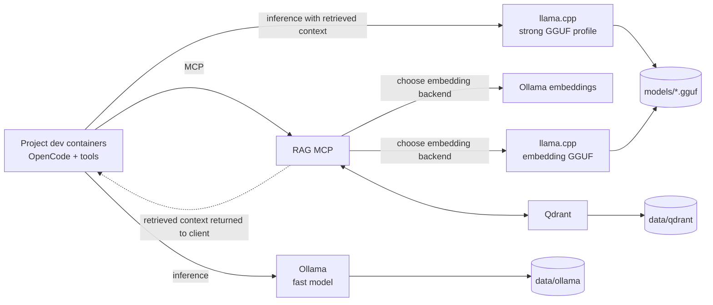

# Local Infrastructure for Coding Assistance


A Docker Compose deployment for shared, local-first coding-agent infrastructure. It runs inference, embeddings, and optional curated-document retrieval while keeping OpenCode-like clients, source code, compilers, tests, and permissions inside each project's own dev container.



All published ports bind to `127.0.0.1`. Nothing is exposed to the LAN by
default.

## 🗂️ Repository Layout

```text
.devcontainer/                 Infrastructure-development container
config/                        Model, RAG, and OpenCode examples
images/                        Thin custom service images
scripts/linux/                 Linux/macOS Bash operator commands
scripts/windows/               Windows PowerShell operator commands
docs/                          Architecture and operating guidance
docker-compose.yml             Base Ollama deployment and optional services
docker-compose.{cpu,nvidia,amd,rag,embeddings-gguf,dev}.yml
```

## ✅ Prerequisites

- Docker Engine or Docker Desktop with Compose v2
- `curl` for Bash host-side smoke tests; PowerShell uses `Invoke-WebRequest`
- Enough disk space for selected models
- NVIDIA Container Toolkit for NVIDIA mode
- `/dev/kfd` and `/dev/dri` access for AMD mode

For NVIDIA, verify the host runtime first:

```bash
./scripts/linux/inspect-gpu.sh nvidia
```

GPU access is granted at container runtime by Compose. Dockerfiles only select
GPU-capable software.

## 🚀 Quick Start

The baseline starts Ollama and is CPU-safe:

```bash
cp .env.example .env
./scripts/linux/up.sh cpu
./scripts/linux/pull-models.sh
./scripts/linux/smoke-test.sh
./scripts/linux/print-endpoints.sh
```

Windows PowerShell:

```powershell
Copy-Item .env.example .env
.\scripts\windows\up.ps1 cpu
.\scripts\windows\pull-models.ps1
.\scripts\windows\smoke-test.ps1
.\scripts\windows\print-endpoints.ps1
```

Use NVIDIA or AMD acceleration:

```bash
./scripts/linux/up.sh nvidia
./scripts/linux/up.sh amd
```

```powershell
.\scripts\windows\up.ps1 nvidia
.\scripts\windows\up.ps1 amd
```

`pull-models` prepares all default model assets: both Ollama models, the
llama.cpp coding GGUF, and the llama.cpp embedding GGUF. Existing GGUF files
are skipped and interrupted downloads resume from `.part` files. The wrapper
rebuilds its small download image before running, so changes to its pull logic
take effect immediately.

Ollama models are stored beneath `DATA_ROOT/ollama`. GGUF files are stored
beneath `MODEL_ROOT`; with the example `.env`, that is `./models` in this
repository. Download progress shows `/models/...` because that is the
corresponding path inside the download container.

Model pulls can be large. The default coding GGUF is approximately 15.4 GB.
Change the model source settings in `.env` before `pull-models.sh` when
validating on limited disk, memory, or network capacity.

## 🦙 llama.cpp

The default pull configuration downloads Unsloth Qwen3.6 35B A3B UD-Q3_K_S
into `./models`. Override the path and Hugging Face repo/file settings in `.env`
to select another coding GGUF, then enable the optional service:

```dotenv
LLAMA_CPP_MODEL_PATH=/models/Qwen3.6-35B-A3B-UD-Q3_K_S.gguf
LLAMA_CPP_MODEL_HF_REPO=unsloth/Qwen3.6-35B-A3B-GGUF
LLAMA_CPP_MODEL_HF_FILE=Qwen3.6-35B-A3B-UD-Q3_K_S.gguf
```

```bash
./scripts/linux/up.sh nvidia llama
```

```powershell
.\scripts\windows\up.ps1 nvidia llama
```

The CPU profile uses the official `server` image with GPU layers set to `0`;
NVIDIA uses `server-cuda` with GPU layers defaulting to `-1` for full offload.
Context, threads, batching, KV-cache types, parallel slots, and GPU layers are
all environment-controlled.

## 🔎 Optional RAG

RAG indexes only curated project memory, not source trees by default. Mount
project directories beneath `./workspaces`, start the stack, then connect an
MCP client to `http://127.0.0.1:8765/mcp`.

```bash
./scripts/linux/up.sh nvidia rag
```

```powershell
.\scripts\windows\up.ps1 nvidia rag
```

Index include/exclude patterns are selected by collection name from
`config/rag/collections.example.yaml`. `RAG_MAX_CONTEXT_TOKENS` limits returned
search content using the same approximate four-characters-per-token policy used
for chunking.

The command above uses Ollama embeddings. To run the full retrieval embedding
path with an embedding-capable GGUF served by llama.cpp:

```bash
./scripts/linux/up.sh nvidia rag gguf-embeddings
```

```powershell
.\scripts\windows\up.ps1 nvidia rag gguf-embeddings
```

Use a local model:

```dotenv
LLAMA_CPP_EMBED_MODEL_PATH=/models/Qwen3-Embedding-0.6B-Q8_0.gguf
LLAMA_CPP_EMBED_MODEL_HF_REPO=Qwen/Qwen3-Embedding-0.6B-GGUF
LLAMA_CPP_EMBED_MODEL_HF_FILE=Qwen3-Embedding-0.6B-Q8_0.gguf
LLAMA_CPP_EMBED_HF_REPO=
LLAMA_CPP_EMBED_MODEL_ID=qwen3-embedding-0.6b-q8_0
LLAMA_CPP_EMBED_POOLING=last
```

To manage either GGUF outside `pull-models`, leave its `*_HF_REPO` or
`*_HF_FILE` setting empty and place the file at the configured model path.

Or let llama.cpp fetch a Hugging Face GGUF on service startup into the persistent llama.cpp cache:

```dotenv
LLAMA_CPP_EMBED_MODEL_PATH=
LLAMA_CPP_EMBED_HF_REPO=Qwen/Qwen3-Embedding-0.6B-GGUF:Q8_0
LLAMA_CPP_EMBED_MODEL_ID=qwen3-embedding-0.6b-q8_0
LLAMA_CPP_EMBED_POOLING=last
```

Available MCP tools:

- `index_project_docs`
- `search_project_memory`
- `list_collections`
- `delete_project_index`

Starting the RAG services does not automatically index projects. A project must
be visible beneath the configured `WORKSPACE_ROOT`, and an MCP client or agent
must call `index_project_docs` with the project's directory name before searches
can return its documentation. Re-index after changing curated documentation.

`LLAMA_CPP_EMBED_MODEL_ID` identifies the loaded GGUF in stored vectors and
search filters. Change it whenever the GGUF model changes.

Re-running `index_project_docs` replaces that project’s index after successfully
upserting current chunks, then removes stale chunks for deleted or shortened
files.

Collections store a reserved identity marker and reject indexing or searching
with a different embedding backend or model identity.

The RAG service detects vector size from the embedding response. A collection
cannot mix dimensions or embedding models; use a new collection or rebuild it
when changing models. See [docs/embedding-models.md](docs/embedding-models.md)
and [docs/architecture.md](docs/architecture.md).

## 🔌 Endpoints

| Service | Host / project dev container | Same Compose network |
|---|---|---|
| Ollama | `http://host.docker.internal:11434/v1` | `http://ollama:11434/v1` |
| llama.cpp | `http://host.docker.internal:8080/v1` | `http://llama-cpp:8080/v1` |
| llama.cpp embeddings | `http://host.docker.internal:8081/v1` | `http://llama-cpp-embeddings:8080/v1` |
| Qdrant | `http://host.docker.internal:6333` | `http://qdrant:6333` |
| RAG MCP | `http://host.docker.internal:8765/mcp` | `http://rag-mcp:8765/mcp` |

On the host, replace `host.docker.internal` with `127.0.0.1`. Linux project
dev containers should add:

```yaml
extra_hosts:
  - "host.docker.internal:host-gateway"
```

## 🧩 Set Up A Project For OpenCode And RAG

OpenCode, project source, project tools, and permissions belong in each
project's own dev container. The shared facility supplies inference and the
optional RAG MCP server. Use the following process for every trusted project
that should use the facility.

### 1. Make The Project Visible To RAG

The `rag-mcp` service receives `${WORKSPACE_ROOT}` as a read-only mount at
`/workspaces`. With the example infrastructure `.env`, `WORKSPACE_ROOT` is
`./workspaces`, so make each project available at:

```text
<infrastructure-repository>/workspaces/<project-name>
```

Place or mount the project beneath this directory. A symlink to a project
outside the bind-mounted root is not reliably available inside Docker,
especially on Docker Desktop. Alternatively, set the infrastructure
`WORKSPACE_ROOT` to a common host directory containing all projects that may be
indexed. Only grant this service access to trusted projects; every directory
beneath that root is readable by `rag-mcp`.

The MCP project argument is the path relative to `WORKSPACE_ROOT`. For example,
`/workspaces/payments-api` is indexed with:

```text
index_project_docs(project="payments-api")
```

### 2. Prepare The Project Dev Container

The project dev container needs Node.js/npm for OpenCode and MCP Inspector, and
it must be able to reach the host-published facility endpoints. A representative
`.devcontainer/devcontainer.json` is:

```jsonc
{
  "name": "Project Development",
  "build": {
    "dockerfile": "Dockerfile"
  },
  "runArgs": [
    "--add-host=host.docker.internal:host-gateway"
  ],
  "postCreateCommand": ".devcontainer/post-create.sh",
  "remoteEnv": {
    "OPENCODE_MODEL": "llamacpp/local"
  },
  "forwardPorts": [6274, 6277],
  "customizations": {
    "vscode": {
      "extensions": [
        "sst-dev.opencode"
      ]
    }
  }
}
```

Docker Desktop normally supplies `host.docker.internal`; the added host mapping
is needed by Linux Docker Engine. For a Compose-based dev container, put the
equivalent `extra_hosts` entry on the project service instead of using
`runArgs`. Ports `6274` and `6277` allow MCP Inspector's UI and proxy to be
forwarded when it runs inside the dev container.

An example `.devcontainer/post-create.sh` that installs OpenCode, MCP Inspector,
and the VS Code CLI tunnel binary is:

```sh
#!/bin/sh
set -eu

archive="$(mktemp)"
trap 'rm -f "$archive"' EXIT

curl --fail --show-error --location \
  'https://code.visualstudio.com/sha/download?build=stable&os=cli-alpine-x64' \
  --output "$archive"

tar -xf "$archive" -C /usr/local/bin
mv /usr/local/bin/code /usr/local/bin/code-tunnel

npm install --global opencode-ai @modelcontextprotocol/inspector
opencode --version
```

This script assumes an Alpine x64 container, Node.js/npm, write access to
`/usr/local/bin`, and permission to install global npm packages. Select the
matching VS Code CLI download for other operating systems or CPU architectures.
For repeatable project environments, pin the OpenCode and MCP Inspector package
versions after validating them.

### 3. Configure OpenCode Providers And MCP

Start from
[`config/opencode/provider-snippet.example.jsonc`](config/opencode/provider-snippet.example.jsonc)
inside the project. It configures the shared Ollama and llama.cpp inference
providers and registers:

```jsonc
{
  "mcp": {
    "rag-mcp": {
      "type": "remote",
      "url": "http://host.docker.internal:8765/mcp",
      "enabled": true,
      "oauth": false
    }
  }
}
```

When OpenCode connects, MCP protocol discovery gives it the RAG tool names,
descriptions, and input schemas. This makes the tools available to the agent,
but does not guarantee that every model will decide to index or search at the
right time. Review the project's OpenCode tool permissions and disable the MCP
entry before working with an untrusted repository.

### 4. Instruct Agents How To Use Project Memory

Add durable instructions to the project's `AGENTS.md` or equivalent agent
instruction file. Treat this as agent guidance, not as a separately installed
skill. For example:

```markdown
## Project Memory

- This repository is available to `rag-mcp` as project `payments-api`.
- Use normal repository search, file reads, tests, and language tools first.
- Use `search_project_memory` for architecture, ADRs, operating procedures,
  and other durable project documentation.
- Call `index_project_docs` after curated documentation changes.
- Search with `project="payments-api"` to avoid retrieving another project's
  documentation from a shared collection.
- Do not delete indexes or use a different collection without explicit approval.
```

Index once after setup, and re-index whenever relevant documentation changes:

```text
index_project_docs(project="payments-api", collection="project_memory")
search_project_memory(
  query="How are database migrations deployed?",
  project="payments-api",
  collection="project_memory"
)
```

### 5. Tune Collections And Retrieval

Collection include/exclude rules live in
[`config/rag/collections.example.yaml`](config/rag/collections.example.yaml).
The selected collection name must match `QDRANT_COLLECTION` or the collection
argument passed to an MCP tool. Missing YAML entries use the built-in curated
patterns.

Useful tuning controls in the infrastructure `.env` are:

| Setting | Purpose |
|---|---|
| `QDRANT_COLLECTION` | Default vector collection used by MCP tools |
| `RAG_TOP_K` | Maximum nearest chunks considered per search |
| `RAG_MAX_CHUNK_TOKENS` | Approximate size of each indexed document chunk |
| `RAG_MAX_CONTEXT_TOKENS` | Approximate total content budget returned to the agent |
| `RAG_COLLECTIONS_CONFIG` | Container path to collection include/exclude rules |
| `EMBEDDING_DOCUMENT_PREFIX` | Optional model-specific prefix for indexed chunks |
| `EMBEDDING_QUERY_PREFIX` | Optional model-specific prefix for search queries |

Keep collections narrow enough to return relevant context. Prefer curated
architecture, ADR, operating, and contribution documentation over recursively
indexing source trees. Use the `project` search filter whenever a collection
contains multiple projects. Increase `RAG_TOP_K` or context budget only after
examining returned results; excessive context can make an agent less effective.

A collection belongs to one embedding backend, model identity, and vector
dimension. When changing the embedding model, use a new collection name or
delete and rebuild the existing collection. Configure required pooling and
document/query prefixes as described in
[docs/embedding-models.md](docs/embedding-models.md).

## 🔬 Verify And Inspect The Facility

### Smoke Test Scope

Run the host-side smoke test after starting the selected services:

```bash
./scripts/linux/smoke-test.sh
```

```powershell
.\scripts\windows\smoke-test.ps1
```

The scripts probe:

- Ollama's native model-list API and OpenAI-compatible model-list API.
- The llama.cpp coding and embedding model-list APIs.
- Qdrant's collections API.
- A real Ollama embedding request and short chat completion.
- A real llama.cpp embedding request and short chat completion.

Unavailable endpoints and failed requests are reported as `SKIP`, so the smoke
test is a permissive endpoint/model probe rather than a strict assertion that
every optional service is running. It does not connect to the RAG MCP endpoint,
discover MCP tools, index a project, search indexed content, inspect retrieval
quality, or verify that an OpenCode agent chooses to use RAG. Use MCP Inspector
for that end-to-end RAG verification.

### Inspect The MCP Endpoint

MCP Inspector can connect to the streamable HTTP endpoint and display the MCP
server's discovered tools and schemas. From a dev container prepared as above:

```bash
npx @modelcontextprotocol/inspector
```

In Inspector, select the Streamable HTTP transport and connect to:

```text
http://host.docker.internal:8765/mcp
```

When running Inspector directly on the infrastructure host, use:

```text
http://127.0.0.1:8765/mcp
```

Verify the RAG path in this order:

1. Confirm Inspector discovers `index_project_docs`, `search_project_memory`,
   `list_collections`, and `delete_project_index`.
2. Call `list_collections`.
3. Call `index_project_docs` for a project visible beneath `WORKSPACE_ROOT`.
4. Search for a distinctive fact from that project's curated documentation.
5. Confirm results contain sensible scores, project names, paths, and content.

The `/mcp` endpoint is a protocol endpoint rather than a static web manifest.
MCP clients initialize a session and use protocol operations such as tool
discovery; a normal browser GET is not a complete MCP verification.

### Inspect And Manage Qdrant

Qdrant is the vector database used by RAG. Its web UI is available on the host
at:

```text
http://127.0.0.1:6333/dashboard
```

Use the dashboard to inspect collection configuration, point counts, payloads,
and stored vectors, or to run Qdrant API requests. Each indexed chunk includes
its project, path, original content, embedding backend, and embedding model.
Each managed collection also contains a reserved identity point used to prevent
mixing incompatible embeddings.

Useful read-only API checks are:

```bash
curl http://127.0.0.1:6333/collections
curl http://127.0.0.1:6333/collections/project_memory
curl -X POST \
  http://127.0.0.1:6333/collections/project_memory/points/scroll \
  -H 'Content-Type: application/json' \
  -d '{"limit":10,"with_payload":true,"with_vector":false}'
```

Prefer the MCP `delete_project_index` tool when removing one project's points.
Deleting an entire collection in Qdrant removes every project's index in that
collection and should be reserved for intentional collection rebuilds. Qdrant
state persists beneath `${DATA_ROOT}/qdrant`.

See [docs/opencode-integration.md](docs/opencode-integration.md) for the
provider/network boundary and [docs/troubleshooting.md](docs/troubleshooting.md)
for common connection and retrieval failures.

## 🎛️ Model Tuning

The `.env` file is the active v1 profile layer. Example future-compatible YAML
profiles live under `config/ollama` and `config/llama-cpp`.

Set `GPU_COUNT` to `all` or a positive integer to control how many NVIDIA
devices each accelerated service reserves.

For a 16 GB GPU, begin with an 8k Ollama context and one request at a time.
Enable llama.cpp only after choosing a quantization and offload level that fits.
Higher context consumes substantial KV-cache memory. See
[docs/model-profiles.md](docs/model-profiles.md).

## 🛠️ Development Container

Open this repository with VS Code Dev Containers to get Docker CLI, Compose,
ShellCheck, Python, Ruff, YAML tooling, and the repository mounted at
`/opt/project`.

Docker socket access is disabled by default in `docker-compose.dev.yml`. This
prevents an agent in the dev container from controlling the Docker daemon,
starting privileged containers, inspecting other containers, or changing the
host Compose stack. Run infrastructure lifecycle commands from a trusted host
shell while the socket remains disabled.

If the agent and repository are trusted and Docker management from inside the
dev container is intentionally required, uncomment this mount in
`docker-compose.dev.yml`, then rebuild the dev container:

```yaml
- /var/run/docker.sock:/var/run/docker.sock # enable if you trust your agent
```

Docker socket access is effectively administrative access to Docker Desktop's
Linux environment. Enable it only for trusted agents and trusted repositories,
and disable it again when it is no longer needed.

## ⚙️ Operations

```bash
./scripts/linux/down.sh
./scripts/linux/down.sh --remove-orphans
make config
make test
make lint
```

Windows PowerShell equivalents:

```powershell
.\scripts\windows\down.ps1
.\scripts\windows\down.ps1 --remove-orphans
.\scripts\windows\inspect-gpu.ps1 nvidia
```

The Bash and PowerShell `up` wrappers keep separate stack-state files, so use
the matching `down` wrapper for the stack you started. See
[docs/windows-hosts.md](docs/windows-hosts.md) for Windows host details.

Persistent state lives under `DATA_ROOT`; GGUF files live under `MODEL_ROOT`.
Do not commit either.

## 📌 Upgrade And Pinning

The examples use moving image tags for an easy first run. For repeatable
deployments, replace image tags in `.env` with tested version tags or digests,
then validate all Compose variants and smoke tests before upgrading. llama.cpp
flags can change, so validate `images/llama-cpp/entrypoint.sh` when changing its
base image.

## 🩺 Troubleshooting

Start with:

```bash
docker compose ps
docker compose logs ollama
./scripts/linux/inspect-gpu.sh nvidia
./scripts/linux/smoke-test.sh
```

See [docs/troubleshooting.md](docs/troubleshooting.md) for common GPU, model,
network, and retrieval failures.
