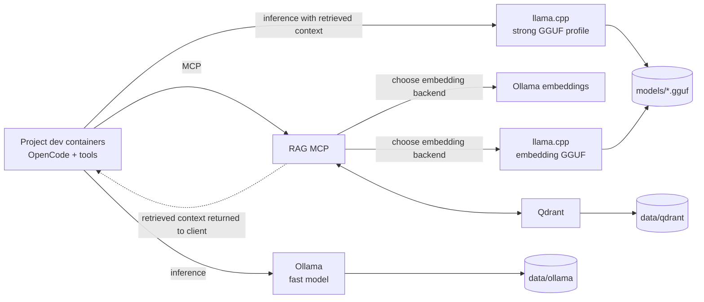

# Local Infrastructure for Coding Assistance


A Docker Compose deployment for shared, local coding-agent infrastructure. It runs inference, embeddings, and optional curated-document retrieval while keeping OpenCode-like clients, source code, compilers, tests, and permissions inside each project's own dev container.



All published ports bind to `127.0.0.1`. Nothing is exposed to the LAN by
default.

## 🗂️ Repository Layout

```text
.devcontainer/                 Infrastructure-development container
config/                        Model, RAG, and OpenCode examples
images/                        Thin custom service images
scripts/linux/                 Linux/macOS Bash operator commands
scripts/windows/               Windows PowerShell operator commands
docs/                          Architecture and operating guidance
docker-compose.yml             Base Ollama deployment and optional services
docker-compose.{cpu,nvidia,amd,rag,embeddings-gguf,dev}.yml
```

## ✅ Prerequisites

- Docker Engine or Docker Desktop with Compose v2
- `curl` for Bash host-side smoke tests; PowerShell uses `Invoke-WebRequest`
- Enough disk space for selected models
- NVIDIA Container Toolkit for NVIDIA mode
- `/dev/kfd` and `/dev/dri` access for AMD mode

For NVIDIA, verify the host runtime first:

```bash
./scripts/linux/inspect-gpu.sh nvidia
```

GPU access is granted at container runtime by Compose. Dockerfiles only select
GPU-capable software.

## 🚀 Quick Start

The baseline starts Ollama and is CPU-safe:

```bash
cp .env.example .env
./scripts/linux/up.sh cpu
./scripts/linux/pull-models.sh
./scripts/linux/smoke-test.sh
./scripts/linux/print-endpoints.sh
```

Windows PowerShell:

```powershell
Copy-Item .env.example .env
.\scripts\windows\up.ps1 cpu
.\scripts\windows\pull-models.ps1
.\scripts\windows\smoke-test.ps1
.\scripts\windows\print-endpoints.ps1
```

Use NVIDIA or AMD acceleration:

```bash
./scripts/linux/up.sh nvidia
./scripts/linux/up.sh amd
```

```powershell
.\scripts\windows\up.ps1 nvidia
.\scripts\windows\up.ps1 amd
```

`pull-models` prepares all default model assets: both Ollama models, the
llama.cpp coding GGUF, and the llama.cpp embedding GGUF. Existing GGUF files
are skipped and interrupted downloads resume from `.part` files. The wrapper
rebuilds its small download image before running, so changes to its pull logic
take effect immediately.

Ollama models are stored beneath `DATA_ROOT/ollama`. GGUF files are stored
beneath `MODEL_ROOT`; with the example `.env`, that is `./models` in this
repository. Download progress shows `/models/...` because that is the
corresponding path inside the download container.

Model pulls can be large. The default coding GGUF is approximately 15.4 GB.
Change the model source settings in `.env` before `pull-models.sh` when
validating on limited disk, memory, or network capacity.

## 🦙 llama.cpp

The default pull configuration downloads Unsloth Qwen3.6 35B A3B UD-Q3_K_S
into `./models`. Override the path and Hugging Face repo/file settings in `.env`
to select another coding GGUF, then enable the optional service:

```dotenv
LLAMA_CPP_MODEL_PATH=/models/Qwen3.6-35B-A3B-UD-Q3_K_S.gguf
LLAMA_CPP_MODEL_HF_REPO=unsloth/Qwen3.6-35B-A3B-GGUF
LLAMA_CPP_MODEL_HF_FILE=Qwen3.6-35B-A3B-UD-Q3_K_S.gguf
```

```bash
./scripts/linux/up.sh nvidia llama
```

```powershell
.\scripts\windows\up.ps1 nvidia llama
```

The CPU profile uses the official `server` image with GPU layers set to `0`;
NVIDIA uses `server-cuda` with GPU layers defaulting to `-1` for full offload.
Context, threads, batching, KV-cache types, parallel slots, and GPU layers are
all environment-controlled.

## 🔎 Optional RAG

RAG indexes only curated project memory, not source trees by default. Mount
project directories beneath `./workspaces`, start the stack, then connect an
MCP client to `http://127.0.0.1:8765/mcp`.

```bash
./scripts/linux/up.sh nvidia rag
```

```powershell
.\scripts\windows\up.ps1 nvidia rag
```

Index include/exclude patterns are selected by collection name from
`config/rag/collections.example.yaml`. `RAG_MAX_CONTEXT_TOKENS` limits returned
search content using the same approximate four-characters-per-token policy used
for chunking.

The command above uses Ollama embeddings. To run the full retrieval embedding
path with an embedding-capable GGUF served by llama.cpp:

```bash
./scripts/linux/up.sh nvidia rag gguf-embeddings
```

```powershell
.\scripts\windows\up.ps1 nvidia rag gguf-embeddings
```

Use a local model:

```dotenv
LLAMA_CPP_EMBED_MODEL_PATH=/models/Qwen3-Embedding-0.6B-Q8_0.gguf
LLAMA_CPP_EMBED_MODEL_HF_REPO=Qwen/Qwen3-Embedding-0.6B-GGUF
LLAMA_CPP_EMBED_MODEL_HF_FILE=Qwen3-Embedding-0.6B-Q8_0.gguf
LLAMA_CPP_EMBED_HF_REPO=
LLAMA_CPP_EMBED_MODEL_ID=qwen3-embedding-0.6b-q8_0
LLAMA_CPP_EMBED_POOLING=last
```

To manage either GGUF outside `pull-models`, leave its `*_HF_REPO` or
`*_HF_FILE` setting empty and place the file at the configured model path.

Or let llama.cpp fetch a Hugging Face GGUF on service startup into the persistent llama.cpp cache:

```dotenv
LLAMA_CPP_EMBED_MODEL_PATH=
LLAMA_CPP_EMBED_HF_REPO=Qwen/Qwen3-Embedding-0.6B-GGUF:Q8_0
LLAMA_CPP_EMBED_MODEL_ID=qwen3-embedding-0.6b-q8_0
LLAMA_CPP_EMBED_POOLING=last
```

Available MCP tools:

- `index_project_docs`
- `search_project_memory`
- `list_collections`
- `delete_project_index`

`LLAMA_CPP_EMBED_MODEL_ID` identifies the loaded GGUF in stored vectors and
search filters. Change it whenever the GGUF model changes.

Re-running `index_project_docs` replaces that project’s index after successfully
upserting current chunks, then removes stale chunks for deleted or shortened
files.

Collections store a reserved identity marker and reject indexing or searching
with a different embedding backend or model identity.

The RAG service detects vector size from the embedding response. A collection
cannot mix dimensions or embedding models; use a new collection or rebuild it
when changing models. See [docs/embedding-models.md](docs/embedding-models.md)
and [docs/architecture.md](docs/architecture.md).

## 🔌 Endpoints

| Service | Host / project dev container | Same Compose network |
|---|---|---|
| Ollama | `http://host.docker.internal:11434/v1` | `http://ollama:11434/v1` |
| llama.cpp | `http://host.docker.internal:8080/v1` | `http://llama-cpp:8080/v1` |
| llama.cpp embeddings | `http://host.docker.internal:8081/v1` | `http://llama-cpp-embeddings:8080/v1` |
| Qdrant | `http://host.docker.internal:6333` | `http://qdrant:6333` |
| RAG MCP | `http://host.docker.internal:8765/mcp` | `http://rag-mcp:8765/mcp` |

On the host, replace `host.docker.internal` with `127.0.0.1`. Linux project
dev containers should add:

```yaml
extra_hosts:
  - "host.docker.internal:host-gateway"
```

## 🧩 OpenCode Integration

OpenCode remains project-local. Start from
[`config/opencode/provider-snippet.example.jsonc`](config/opencode/provider-snippet.example.jsonc)
inside each trusted project and review its permissions before use. See
[docs/opencode-integration.md](docs/opencode-integration.md).

## 🎛️ Model Tuning

The `.env` file is the active v1 profile layer. Example future-compatible YAML
profiles live under `config/ollama` and `config/llama-cpp`.

Set `GPU_COUNT` to `all` or a positive integer to control how many NVIDIA
devices each accelerated service reserves.

For a 16 GB GPU, begin with an 8k Ollama context and one request at a time.
Enable llama.cpp only after choosing a quantization and offload level that fits.
Higher context consumes substantial KV-cache memory. See
[docs/model-profiles.md](docs/model-profiles.md).

## 🛠️ Development Container

Open this repository with VS Code Dev Containers to get Docker CLI, Compose,
ShellCheck, Python, Ruff, YAML tooling, and the repository mounted at
`/opt/project`. The Docker socket is mounted so the dev container can manage
the host Compose stack.

## ⚙️ Operations

```bash
./scripts/linux/down.sh
./scripts/linux/down.sh --remove-orphans
make config
make test
make lint
```

Windows PowerShell equivalents:

```powershell
.\scripts\windows\down.ps1
.\scripts\windows\down.ps1 --remove-orphans
.\scripts\windows\inspect-gpu.ps1 nvidia
```

The Bash and PowerShell `up` wrappers keep separate stack-state files, so use
the matching `down` wrapper for the stack you started. See
[docs/windows-hosts.md](docs/windows-hosts.md) for Windows host details.

Persistent state lives under `DATA_ROOT`; GGUF files live under `MODEL_ROOT`.
Do not commit either.

## 📌 Upgrade And Pinning

The examples use moving image tags for an easy first run. For repeatable
deployments, replace image tags in `.env` with tested version tags or digests,
then validate all Compose variants and smoke tests before upgrading. llama.cpp
flags can change, so validate `images/llama-cpp/entrypoint.sh` when changing its
base image.

## 🩺 Troubleshooting

Start with:

```bash
docker compose ps
docker compose logs ollama
./scripts/linux/inspect-gpu.sh nvidia
./scripts/linux/smoke-test.sh
```

See [docs/troubleshooting.md](docs/troubleshooting.md) for common GPU, model,
network, and retrieval failures.
