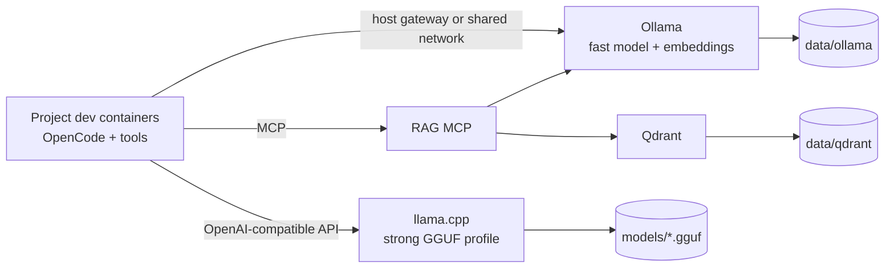

# Local AI Coding Facility

A Docker Compose deployment for shared, local coding-agent infrastructure. It runs inference, embeddings, and optional curated-document retrieval while letting developers maintain OpenCode-like clients, source code, compilers, tests, and permissions inside each project's own dev container.



All published ports bind to `127.0.0.1`. Nothing is exposed to the LAN by
default.

## Repository Layout

```text
.devcontainer/                 Infrastructure-development container
config/                        Model, RAG, and OpenCode examples
images/                        Thin custom service images
scripts/                       Stable operator commands
docs/                          Architecture and operating guidance
docker-compose.yml             Base Ollama deployment and optional services
docker-compose.{cpu,nvidia,amd,rag,dev}.yml
```

## Prerequisites

- Docker Engine or Docker Desktop with Compose v2
- `curl` for host-side smoke tests
- Enough disk space for selected models
- NVIDIA Container Toolkit for NVIDIA mode
- `/dev/kfd` and `/dev/dri` access for AMD mode

For NVIDIA, verify the host runtime first:

```bash
./scripts/inspect-gpu.sh nvidia
```

GPU access is granted at container runtime by Compose. Dockerfiles only select
GPU-capable software.

## Quick Start

The baseline starts Ollama and is CPU-safe:

```bash
cp .env.example .env
./scripts/up.sh cpu
./scripts/pull-models.sh
./scripts/smoke-test.sh
./scripts/print-endpoints.sh
```

Use NVIDIA or AMD acceleration:

```bash
./scripts/up.sh nvidia
./scripts/up.sh amd
```

Model pulls can be large. Change `FAST_MODEL_OLLAMA` in `.env` to a smaller
model before `pull-models.sh` when validating on CPU or limited hardware.

## llama.cpp

Place a GGUF file in `./models`, set its container path in `.env`, then enable
the optional service:

```dotenv
LLAMA_CPP_MODEL_PATH=/models/my-coding-model.gguf
```

```bash
./scripts/up.sh nvidia llama
```

The CPU profile uses the official `server` image and NVIDIA uses
`server-cuda`. Context, threads, batching, KV-cache types, parallel slots, and
GPU layers are all environment-controlled.

## Optional RAG

RAG indexes only curated project memory, not source trees by default. Mount
project directories beneath `./workspaces`, start the stack, then connect an
MCP client to `http://127.0.0.1:8765/mcp`.

```bash
./scripts/up.sh nvidia rag
```

Available MCP tools:

- `index_project_docs`
- `search_project_memory`
- `list_collections`
- `delete_project_index`

The embedding model must be pulled and `EMBEDDING_DIM` must match its output.
See [docs/architecture.md](docs/architecture.md) for the retrieval boundary.

## Endpoints

| Service | Host / project dev container | Same Compose network |
|---|---|---|
| Ollama | `http://host.docker.internal:11434/v1` | `http://ollama:11434/v1` |
| llama.cpp | `http://host.docker.internal:8080/v1` | `http://llama-cpp:8080/v1` |
| Qdrant | `http://host.docker.internal:6333` | `http://qdrant:6333` |
| RAG MCP | `http://host.docker.internal:8765/mcp` | `http://rag-mcp:8765/mcp` |

On the host, replace `host.docker.internal` with `127.0.0.1`. Linux project
dev containers should add:

```yaml
extra_hosts:
  - "host.docker.internal:host-gateway"
```

## OpenCode Integration

OpenCode remains project-local. Start from
[`config/opencode/provider-snippet.example.jsonc`](config/opencode/provider-snippet.example.jsonc)
inside each trusted project and review its permissions before use. See
[docs/opencode-integration.md](docs/opencode-integration.md).

## Model Tuning

The `.env` file is the active v1 profile layer. Example future-compatible YAML
profiles live under `config/ollama` and `config/llama-cpp`.

For a 16 GB GPU, begin with an 8k Ollama context and one request at a time.
Enable llama.cpp only after choosing a quantization and offload level that fits.
Higher context consumes substantial KV-cache memory. See
[docs/model-profiles.md](docs/model-profiles.md).

## Development Container

Open this repository with VS Code Dev Containers to get Docker CLI, Compose,
ShellCheck, Python, Ruff, YAML tooling, and the repository mounted at
`/opt/project`. The Docker socket is mounted so the dev container can manage
the host Compose stack.

## Operations

```bash
./scripts/down.sh
./scripts/down.sh --remove-orphans
make config
make lint
```

Persistent state lives under `DATA_ROOT`; GGUF files live under `MODEL_ROOT`.
Do not commit either.

## Upgrade And Pinning

The examples use moving image tags for an easy first run. For repeatable
deployments, replace image tags in `.env` with tested version tags or digests,
then validate all Compose variants and smoke tests before upgrading. llama.cpp
flags can change, so validate `images/llama-cpp/entrypoint.sh` when changing its
base image.

## Troubleshooting

Start with:

```bash
docker compose ps
docker compose logs ollama
./scripts/inspect-gpu.sh nvidia
./scripts/smoke-test.sh
```

See [docs/troubleshooting.md](docs/troubleshooting.md) for common GPU, model,
network, and retrieval failures.

